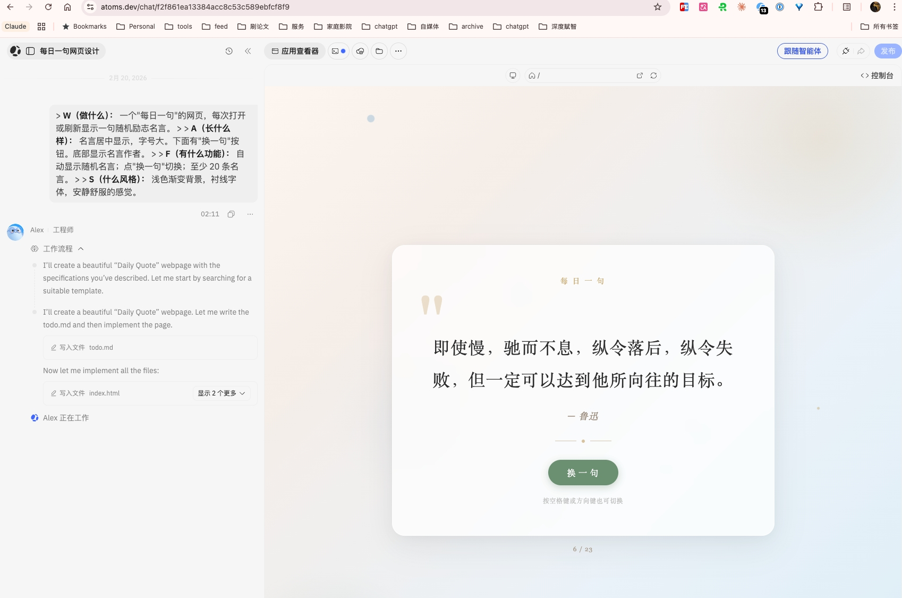

# 第六章：从零开始做一个项目

> **本章你将学到：** 从"我有一个想法"到"做出成品"的完整过程，以及可以反复使用的通用方法论。

## 理论学够了，动手吧

前面几章你学了 vibe coding 是什么、准备了工具、学会了怎么和 AI 对话。现在，是时候用这些知识做一个真正属于你自己的东西了。

**重要声明：** 这一章我会用一个示例项目来演示整个过程，但**请不要照抄我的项目**。你应该做自己想做的东西——这才是 vibe coding 最有趣的部分。跟着我的方法走，但用你自己的想法。

我的示例项目是：一个"每日一句"的网页，每次打开显示一句随机励志名言。你的项目可以是任何你想做的东西。

## 第一步：想清楚你要做什么

**先别急着打开工具。** 花 5 分钟想一想你要做什么。

如果你还没有想法，这里有一些可以启发你的方向：

- 你有没有想给朋友看的**个人主页**？展示你的经历、作品、爱好
- 你有没有一个**小工具**的想法？比如倒计时器、生日提醒、记账本、打卡器、单位换算
- 你有没有想给自家的小店做一个**简单的展示页**？放上地址、电话、菜单或商品
- 你有没有一个想做成网页的**计算器或转换器**？比如汇率换算、BMI 计算、房贷计算器
- 你有没有想做一个**简单的小游戏**？比如猜数字、翻牌配对、打字测速
- 你有没有一个**信息收集的需求**？比如活动报名页、调查问卷、投票页面

**小贴士：** 第一个项目建议选简单一点的——一个单页面的东西最合适。不要一上来就想做一个"完整的电商网站"，那是后面的事。

### 把模糊的想法变具体

有了一个大概的方向后，用我们在第五章学的 **WAFS 框架**来整理你的想法：

> **我的示例：**
>
> **W（做什么）：** 一个"每日一句"的网页，每次打开或刷新显示一句随机励志名言。
>
> **A（长什么样）：** 名言居中显示，字号大。下面有"换一句"按钮。底部显示名言作者。
>
> **F（有什么功能）：** 自动显示随机名言；点"换一句"切换；至少 20 条名言。
>
> **S（什么风格）：** 浅色渐变背景，衬线字体，安静舒服的感觉。

**你来试试：** 在纸上或手机备忘录里，用 WAFS 框架把你的想法写下来。不需要写得很完美，有个大概就行。

## 第二步：写出你的第一条 Prompt

把你的 WAFS 描述整理成一段完整的话，这就是你给 AI 的第一条 prompt。

> **我的示例 Prompt：**
>
> 帮我做一个"每日一句"的网页。要求如下：
> - 每次打开或刷新页面，显示一句随机的励志名言
> - 名言文字居中显示，字号要大（至少 24px）
> - 名言下方显示作者名字，字号小一些，灰色
> - 页面底部有一个"换一句"按钮，点击后显示另一句名言
> - 准备至少 20 条中文励志名言
> - 背景用米白到浅灰的渐变，整体风格安静、舒服
> - 字体用衬线体

**小建议：** 在打开工具之前先把 prompt 写好。把它写在记事本或者文档里，然后复制粘贴到 AI 对话框里。这样你可以反复斟酌，不用在工具里边想边打字。

把这段文字粘贴到你选好的工具（Bolt.new / Trae / Cursor）的 AI 对话框里，回车，等 AI 工作。

几十秒后，你就能看到 AI 做出来的第一个版本了。下面是一个真实的例子——左边是输入的 WAFS 需求描述，右边是 AI 生成的"每日一句"页面：

## 第三步：审视结果，提出修改

看到第一版后，**不要急着改**。先整体看一遍：

**哪些地方满意？** 记下来，不需要动。

**哪些地方不满意？** 列一个修改清单。比如：
- 字号还是小了
- 按钮不够明显
- 背景颜色不太对
- 名言的位置偏上了

然后，**每次只改一件事。**

### 第一轮修改

> 名言的字号太小了，改成 32px。"换一句"按钮做得更明显一些，用圆角矩形，浅蓝色背景。

<!-- screenshot: 第一轮修改后的效果 -->

### 第二轮修改

> 背景渐变的颜色不太对，我想要更暖一些的感觉——从米白色（#FAF8F5）到浅杏色（#FDF2E9）。

<!-- screenshot: 第二轮修改后的效果 -->

### 第三轮修改

> 作者的名字前面加一个破折号，变成"—— 某某某"的格式。按钮和名言之间的间距再大一些。

<!-- screenshot: 第三轮修改后的效果 -->

看到了吗？通过三轮简短的对话，页面已经从"差不多"变成"比较满意"了。每次改一件事，效果一目了然，不容易改乱。

### 修改的关键心法

你可能会想："改三轮会不会太麻烦了？能不能一次说完？" 答案是：可以，但不建议。

原因很简单：如果你一次改了五个地方，结果有一个地方改得很好但另一个地方改坏了，你就很难判断问题出在哪。而如果每次只改一个地方，你能清楚地看到每个修改的效果，心里有数。

另外，**不要追求一步到位**。AI 的第一版输出几乎不可能完美，这很正常。即使是专业设计师做一个页面，也要反复调整好多遍。把每一轮对话想象成你和 AI 之间的"协商"——你说想法，它做出来，你看看满不满意，不满意再说。三五轮下来，通常就能得到一个相当不错的结果了。

## 第四步：逐步添加功能

基础版满意之后，可以开始加一些新功能了。同样的原则——**一次加一个**。

### 添加"收藏"功能

> 帮我加一个"收藏"功能。在每句名言旁边加一个爱心图标，点击后名言被收藏。在页面某个地方可以查看已收藏的名言列表。

<!-- screenshot: 添加收藏功能后的效果 -->

**测试一下：** 点击爱心图标，看看是不是正常工作。切换名言后再收藏一句，检查收藏列表是不是都有。

### 添加"分享"功能

> 加一个"复制文字"按钮，点击后把当前名言和作者的文字复制到剪贴板，然后显示一个"已复制"的提示。

<!-- screenshot: 添加分享功能后的效果 -->

每加一个功能就测试一下，确认没问题再加下一个。如果某个功能出了问题，先参考第七章的方法解决，不要急着加新功能。

### 功能优先级

你可能脑子里有十个想法，但不需要全都做。问自己两个问题：

1. **这个功能是"必须有"还是"有了更好"？** 先做必须有的。
2. **这个功能在目前的基础上加，复杂吗？** 先做简单的，把难的留到后面。

比如对于"每日一句"网页来说：
- 收藏功能 → 不太复杂，可以做
- 分享到微信 → 比较复杂（涉及微信接口），先跳过
- 用户可以自己添加名言 → 中等复杂，看你时间
- 支持多国语言 → 比较复杂，以后再说

**把功能按"简单→复杂"排序，从简单的做起，你会有持续的成就感。**

## 第五步：调整样式和细节

功能都做好了，最后来打磨外观。

> 整体看一下这个页面，帮我做以下调整：
> 1. 在手机上看的时候，确保布局是适配的，名言文字不要超出屏幕
> 2. 按钮在手机上要足够大，方便手指点击
> 3. 加一个淡入的动画效果——页面打开和切换名言时，文字用 0.5 秒的淡入动画出现

<!-- screenshot: 移动端适配效果和动画效果 -->

到这里，一个完整的"每日一句"网页就做好了。从零到成品，整个过程大概花了 15-20 分钟。

如果你用的是自己的项目，恭喜——你现在有了一个可以给别人看的东西。如果它还不够完美，没关系。**一个做出来的 80 分作品，永远好过一个只存在于脑子里的 100 分构想。**

## 通用技巧总结

不管你做的是什么项目，以下四条"黄金法则"都适用：

### 黄金法则 1：先做骨架，再加功能，最后调样式

就像盖房子——先搭建结构（基本布局和核心内容），再装修功能（添加交互），最后美化外观（调颜色、字体、动画）。不要一上来就纠结颜色好不好看。

### 黄金法则 2：每次只改一件事

一次改一件事，你能清楚地看到每次修改的效果。如果一次改三件事，结果不满意的时候你都不知道是哪个改坏了。

### 黄金法则 3：满意一个部分，再做下一个

不要在一个部分还没搞定的时候就急着做下一个。把当前的部分做到你满意为止，再往前走。这样你始终有一个"可用的版本"在手里。

### 黄金法则 4：随时可以问 AI"这个能不能做"

不确定某个功能 AI 能不能做？直接问它：

> "我想在这个页面上加一个功能：用户可以自己输入一句名言添加到列表里。这个能做吗？"

AI 通常会告诉你能做还是不能做，如果能做还会告诉你大概怎么做。你因此可以更好地判断要不要加这个功能。

## 你的成果时刻

如果你跟着做了（不管是用我的示例项目，还是用你自己的想法），现在你应该有了自己的第一个 vibe coding 作品。

<!-- screenshot: 最终完成的示例项目——"每日一句"网页的完成效果 -->

不完美没关系。它可能有些粗糙，可能有些地方还不太满意。但**最重要的是，你做出来了**。

你用自然语言，一句句地告诉 AI 你想要什么，它就帮你做出来了。而在几个月前，做这样一个东西可能需要几天的编程学习。

把这个页面截图发给朋友看看吧——"这是我用 AI 做的"。

## 本章小结

- **从想法到成品的五步流程：**
  1. 想清楚你要做什么（用 WAFS 框架）
  2. 写出第一条 prompt
  3. 审视结果，逐步修改
  4. 一次加一个功能
  5. 最后打磨样式
- **四条黄金法则：** 先骨架后功能后样式、每次改一件事、满意再往前走、随时问 AI
- 做出来比做完美更重要

## 下一步预告

做项目的过程中，你可能已经遇到了一些小问题——AI 做的和你想的不一样，或者某个功能出了 bug。下一章我们就来专门聊聊：当 AI 搞砸了的时候怎么办。
